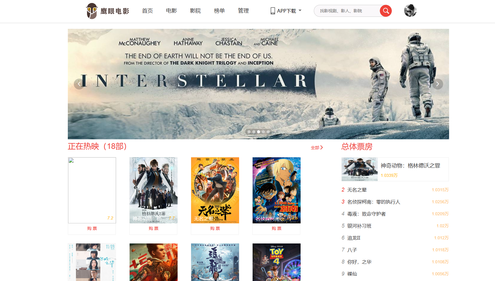
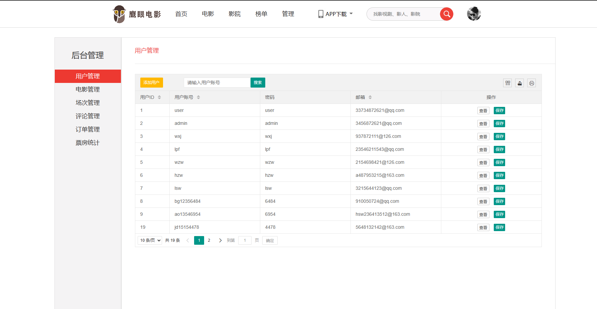
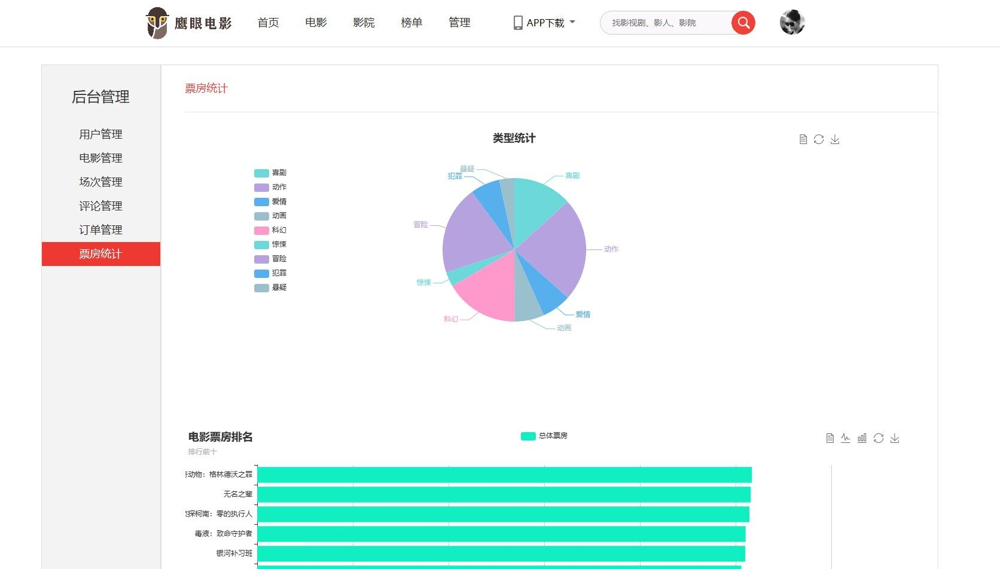
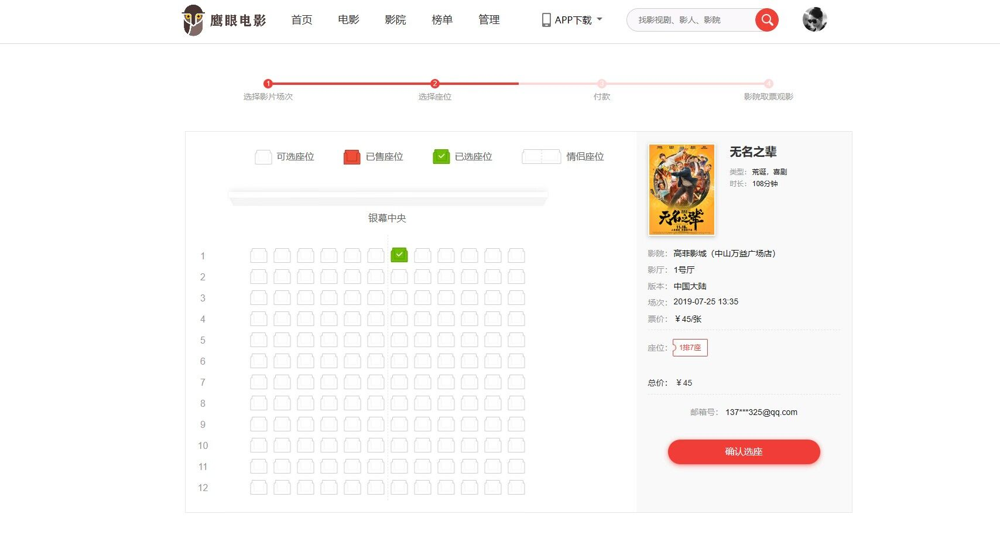

# 数据库 + Web课作业：鹰眼电影 
鹰眼电影——仿照猫眼电影开发的web服务。 
## 关于本地开发
将`movie.sql`导入到数据库中，`application.yml`修改数据库连接密码，默认`123456`，数据库`movie`

管理员账号：`admin` 密码：`admin`

## 项目设计
### 总体设计
- 本项目用到的技术和框架
1. 项目构建：Maven
2. web框架：Springboot
3. 数据库ORM：Mybatis
4. 数据库连接池： Druid
5. 分页插件：PageHelper
6. 数据库：MySql. 
7. 前端模板：Thymeleaf

- 开发环境

| 工具 | 名称 |
| --- | --- |
| 开发工具 | IDEA |
| 语言 | JDK11、js |
| 项目架构 | SSM |
| ORM | Mybatis |
| 项目构建 | Maven |
| 前端组件库 |bootstrap、layui|

## 页面展示
首页页面

后台管理

购票界面

统计界面

## 打包、部署和运行
- 本项目采用Springboot的maven插件进行打包，打包结果：****.jar
- 部署方式：使用 nohup java -jar .jar >.log 2>&1 &的方式，后台启动项目，并在该路径下生成运行日志

## 总结
本人前端功底薄弱，这里相当一部分是借助框架和别人做好的界面，特此感谢。

本项目并不难，但需要花费些时间在`service`层上的数据清洗。

数据库CRUD,mybatis的`.xml`数据库关系文件的编写是借助逆向插件`mybatis-generator-maven-plugin`先写好模版、后期结合手写完成。

`数据库课程设计.docx` 和 `电影院自助售票&管理系统.pdf` 由我的组员和我共同完成， 特此感谢。
> 如果项目遇到图片加载不出来，目前发现的原因是请求头位json请求，等待后期处理......

## 鸣谢
https://github.com/banbanzzz/Movie
